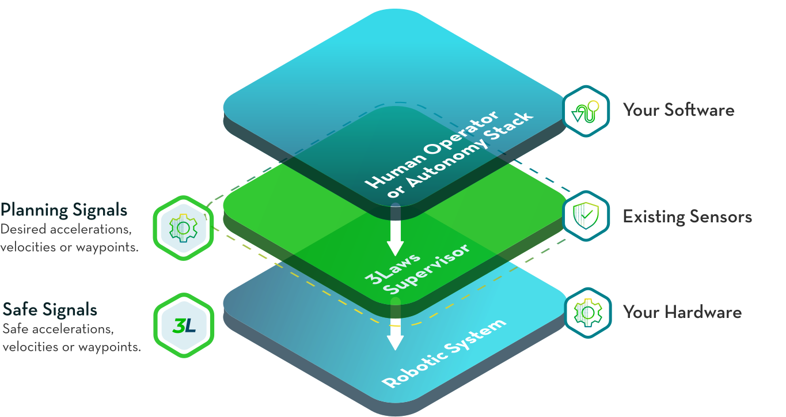
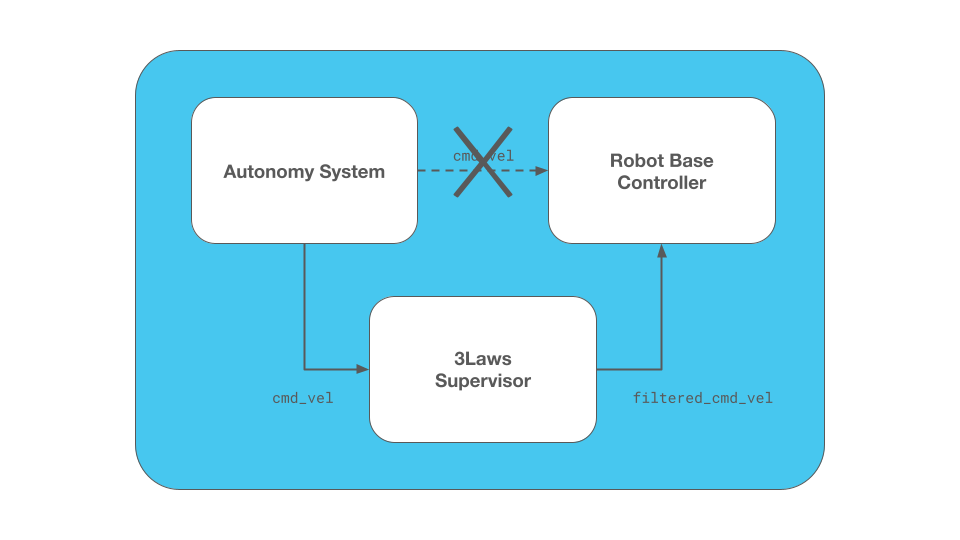
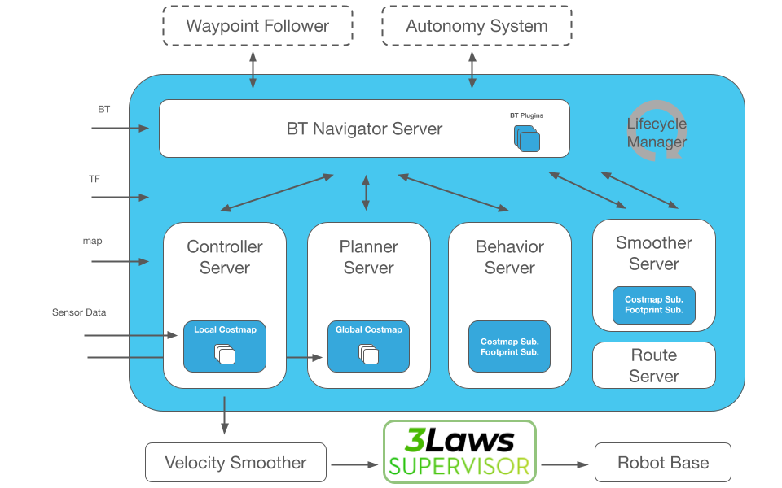
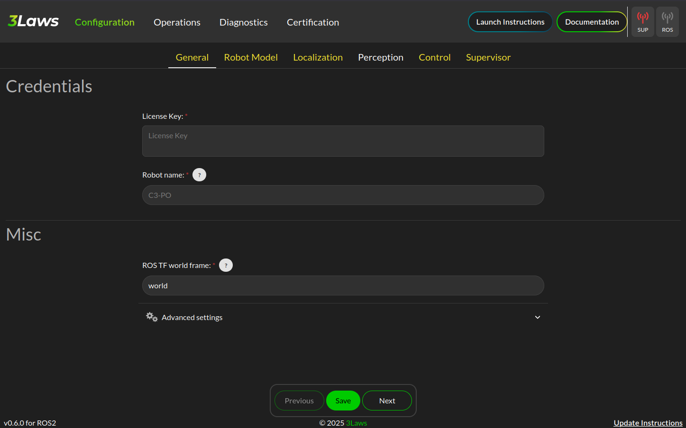
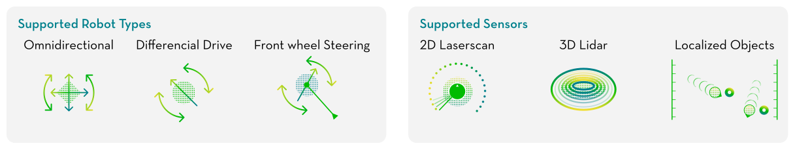
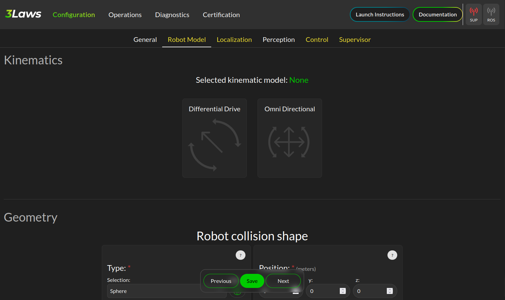
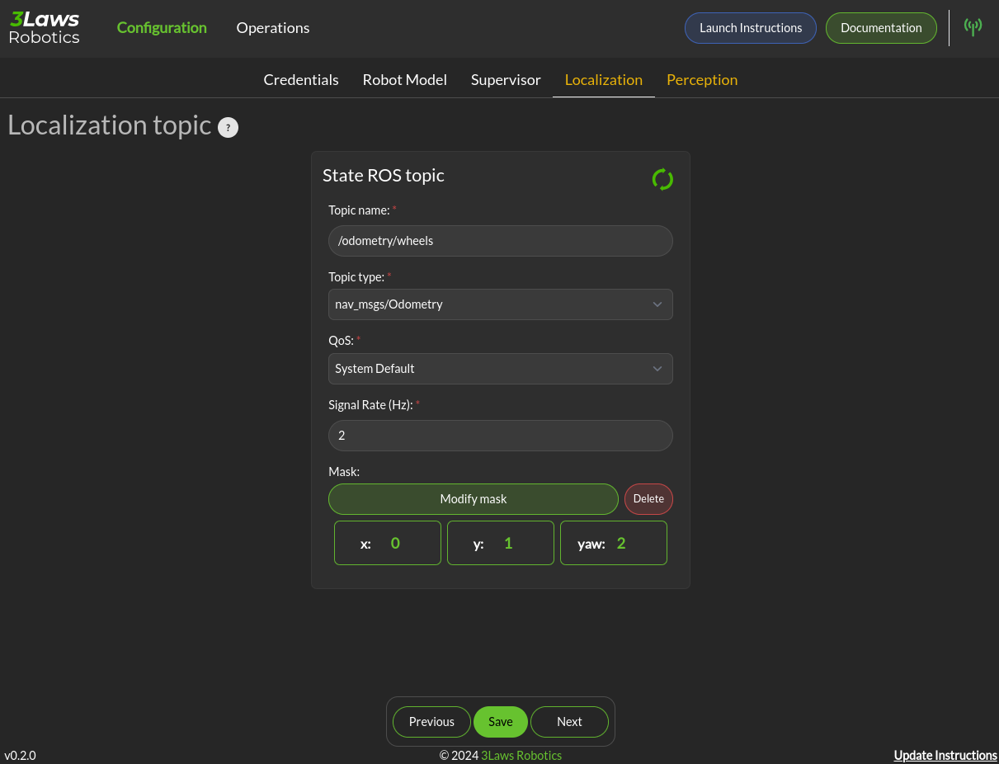
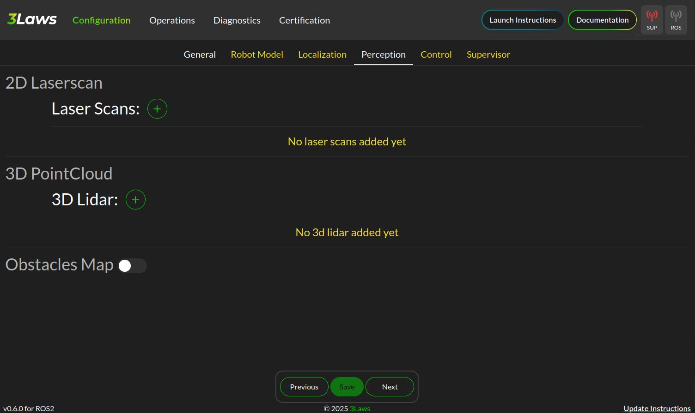
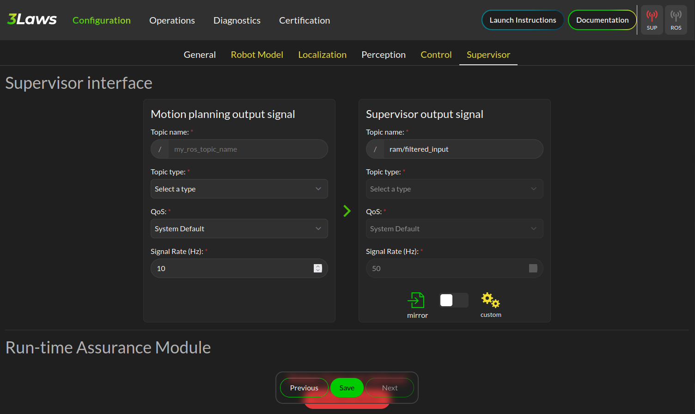

.. _navigation2_with_3laws_supervisor:

Enhanced Safety for Nav2 using 3Laws Supervisor
===============================================

.. raw:: html

  

    <iframe width="100%" height="480" src="https://www.youtube.com/embed/KDMI70BuDs0?autoplay=1&mute=1" title="3Laws Supervisor demo" frameborder="0" allow="accelerometer; autoplay; clipboard-write; encrypted-media; gyroscope; picture-in-picture" allowfullscreen></iframe>
  

This tutorial provides a walkthrough of how to integrate the `3Laws Robotics <https://3laws.io/>`_ Supervisor with the Nav2 stack to enhance safety during navigation tasks.
The 3Laws Supervisor is a dynamic collision avoidance solution that can augment Nav2 for production safety-conscious environments.
It provides a layer that monitors the robot's behavior and sensors to adjust the robot's desired trajectory in real-time to better avoid collisions and other hazards.
Rather than stopping or slowing as is typical in many safety or collision monitoring systems (i.e. ``nav2_collision_monitor`` or safety-rated lidar zones), the 3Laws Supervisor is designed to actively avoid collisions while still continuing towards its goal through a 'force-field' or 'deflection' effect.
Dynamic safety, thus, adds two types of efficiency to the production area: (1) the robots avoid stoppages and are more productive because of increased runtime; and (2) infrastructure is more *efficient* as less physical work is needed to maintain adequate or excellent safety levels.
Though, it will still stop the robot when required.

Rather than a strict replacement, this should be integrated in concert with other safety-rated systems, global replanning, trajectory planners, and/or the Nav2 Collision Monitor.
The safety zone behavior of traditional systems can be provided to the 3Laws Supervisor so it has awareness of the safety system to make informed decisions about how to adjust the robot's trajectory without triggering it, wherever possible.
Though, the Supervisor can also be used as a standalone solution to provide collision avoidance.

The Supervisor is available in both a free community tier (Supervisor ROS CE) and two paid commercial tiers with additional features and support.
The community tier provides same functionality for collision avoidance and is suitable for many applications as Supervisor ROS, but limited to early-stage startups and R&D.
This tutorial focuses only on the features that are part of the community, Supervisor ROS (CE).
The commercial tier, Supervisor Pro, includes additional features such as: geofencing, stabilization, configuration limiting, command monitoring, altitude limitations, professional setup and support, and more.
To learn more about Supervisor Pro, `please contact 3Laws Robotics <https://3laws.io/contact/>`_.

.. note::

   Disclosure: This tutorial is sponsored by 3Laws Robotics in partnership with Open Navigation.
   The contents of this tutorial and demonstrations were written and performed by the Open Navigation team.
   The opinions and thoughts shared are honest reflections of our independent assessment.

Concepts
--------

Traditional safety systems for AMRs and mobile robots typically involve stopping or slowing down the robot when an obstacle is detected.
This is often implemented using safety-rated 2D lidars with safety zones which trigger a stop or slow down when an obstacle is detected within a certain window.
These zones are configured to ensure the robot can stop safely before colliding with an obstacle or slow down to a safer speed to avoid potential future collisions - frequently with safety zones scheduled based on the current robot velocity regime.
These solutions are generally effective when properly implemented, but they can lead to inefficiencies in dynamic operations and require purchasing expensive safety-rated hardware.
Alternatively, AGVs may use static safety measures such as light curtains and physical separation which require reconstruction and cannot be reconfigured easily.
Adding safety capabilities to the robot eliminates the burden of taking static safety measures.

Applications that do not require safety-rating or are not able to leverage expensive safety-rated lidars can typically use the Nav2 Collision Monitor or similar to stop or slow down the robot when an obstacle is detected.
This is a software-based solution that monitors the robot's sensors (lidar, depth camera, sonar, etc) to detect obstacles and trigger a stop or slow down.
This is broadly analog to traditional safety-rated systems, but it does not provide the same level of safety assurance. 
However, it has the same limitations due to the slow-and-stop nature of the solution.

The Supervisor ROS uses a dynamic approach to collision avoidance to enhance safety while addressing the efficiency challenges and lightening the system tuning load.
Rather than solely stopping or slowing down when an obstacle is detected in proximity to the robot, the Supervisor takes over and adjusts the robot's trajectory in real-time to avoid collisions while still making progress towards its goal - also considering lower-level safety constraints described above if present (Pro version). 
This allows the robot to dynamically react to the environment while not prematurely stopping or slowing when maneuvers are available which can prevent triggering safety system reactions - increasing throughput.
It will however still stop the robot is required as any other safety system might.
For best use, a system should still contain a global replanning mechanism and/or a trajectory planner that considers collision.
The Supervisor should complement these systems rather than completely replacing them for maximum effectiveness, *especially* on robots moving fast, with heavy loads, or slow dynamics.
This can allow users to reduce the amount of tuning of Nav2's highly configurable but complex controller parameters, moving faster to market.
It is also very good for teleoperation tasks either joysticking locally or via remote monitoring systems to avoid collisions due to remote operation delays! 

.. note::

   Supervisor should be paired with some global replanning and/or obstacle-avoiding trajectory planner is so that the Supervisor is not at odds with the trajectory planner, making it unable to route around obstacles and instead stops the robot. For example, if using Pure Pursuit to follow the path accurately with no global replanning, as the Supervisor deviates from the path, the algorithm will attempt to steer the robot back on the path into the obstacle. In such a case, the command's velocity 'intent' to move forward along the path is now replaced with driving into the obstacle to correct for the tracking error, creating a conflict with the Supervisor's attempt to avoid the obstacle. Thus, some kind of global replanning to avoid obstacles and/or use of a collision-avoiding trajectory planner like MPPI or DWB is recommended.

   This, however, is not an issue with teleoperations since the teleoperation command will not adjust to track a path.

If you wish to learn more about the technology behind the Supervisor, checkout the `3Laws Knowledge Base <https://docs.3laws.io/en/latest/sources/knowledge.html>`_ page.

.. image:: images/3laws_supervisor/graphics/3laws_amr2.gif
  :alt: 3Laws AMR demo
  :align: center
  :width: 100%

0. Obtain a License Key
-----------------------

Supervisor ROS is available in a free community tier, but still requires a license key to be used.
The license key can be obtained by requesting a key from the `3Laws Robotics Free-Trial <https://3laws.io/free-trial-new/>`_ page or by navigating from the 3Laws home page and clicking 'Get Started' in the upper right corner.
Once approved, the license key will be sent to the email address provided in the request form.
It can be verified in Step 1 below in the Supervisor configuration GUI.

1. Installation
---------------

The GUI can be setup using the instructions provided by `3Laws Robotics Install Supervisor <https://docs.3laws.io/en/latest/sources/getting_started.html#install-supervisor>`_. To install the Supervisor via binaries, run the following install command:

.. code-block:: bash

   bash <(curl https://raw.githubusercontent.com/3LawsRobotics/3laws/master/install.sh)

This may prompt you information about which ROS distribution you are using and what version of Supervisor you wish to install, if a ROS distribution is not currently sourced in this terminal.
Then, run the control panel via

.. code-block:: bash

   3laws control-panel autostart enable

If attempting to install this script within your own application Docker image, you may use the CLI arguments of this script to specify the ROS distribution, architecture, Ubuntu version, and tag explicitly.

.. code-block:: dockerfile

   RUN bash <(curl https://raw.githubusercontent.com/3LawsRobotics/3laws/master/install.sh) -fy -r humble -a amd64 -v 22.04 -t latest

To run the configuration GUI server in this docker container, you will also want the following ``entrypoint.sh`` in your Dockerfile to start the Supervisor control panel and rosbridge server:

.. code-block:: bash

   #!/bin/bash
   set -e # Exit immediately if a command exits with a non-zero status

   /opt/3laws/control_panel/control-panel-backend 8000 /opt/3laws/control_panel/build/ &
   source /opt/ros/humble/setup.bash  # Replace with your ROS distribution if different
   ros2 launch rosbridge_server rosbridge_websocket_launch.xml port:=9091 &
   ros2 launch lll_supervisor supervisor.launch.py  # If you want it to run automatically only

   bash

.. note::

   When launching Supervisor for the first time (whether inside a docker container or not), you may see the error below. It is indicating that the Supervisor ROS node has not been configured yet and thus cannot start. As we're going to configure it next, this is fine and the backend control panel is still running. After configuration if using Docker, the container would need to be restarted to run the Supervisor node with the newly set configuration.

   .. code-block:: bash

      [supervisor-1] [2025-07-23 17:44:48.878] [error] bad file: /home/3laws/.3laws/config/supervisor.yaml
      [supervisor-1] [2025-07-23 17:44:48.913] [critical] Exception thrown during 3laws Supervisor initialization
      [supervisor-1] [2025-07-23 17:44:48.913] [info] Stopping 3laws Supervisor...
      [supervisor-1] [2025-07-23 17:44:48.913] [info] 3laws Supervisor stopped!
      [ERROR] [supervisor-1]: process has died [pid 56, exit code 1, cmd '/opt/ros/humble/lib/lll_supervisor/supervisor --ros-args --disable-stdout-logs --ros-args --params-file /tmp/launch_params_g1f3o7xg'].

Whether using the binaries or Docker image, you can now run the Supervisor control panel to configure the Supervisor and deploy it to your robot.
When you visit http://localhost:8080, you should now see a web-based control panel for the Supervisor, shown below.

2. Initial Configuration Walkthrough
------------------------------------

Initializing Configuration with Nav2
^^^^^^^^^^^^^^^^^^^^^^^^^^^^^^^^^^^^

To ease the configuration of the Supervisor, we can use the ``nav2_config_extractor_cli.py`` script to extract parameters from a set of Nav2 and/or Robot Localization configuration files and initialize the Supervisor configuration.
In the future, this will be integrated directly into the Supervisor control panel, but for now we will run this script manually and pass them into the control panel.

These are the options for the shared parameter extractor.

  *  ``--verbose -v`` Enable verbose logging.
  *  ``--files`` A space separated list of file paths to Nav2 parameter files to extract.
  *  ``--output`` File path to output the extracted shared configurations.
  *  ``--deconfliction`` Strategy for handling duplicate possible values for shared configurations (options: 'first' to use the first value, 'last' to use the last value, and 'prompt' to prompt you to select the value you'd like to use).

For example:

.. code-block:: bash

   python3 nav2_config_extractor_cli.py \
     --files /path/to/nav2_params.yaml /path/to/robot_localization_params.yaml \
     --output /path/to/extracted_shared_configs.json \
     --deconfliction prompt

When prompted in the control panel, navigate to the extracted shared configurations file and select it.
This will automatically pre-populate the Supervisor configurations with your robot's set kinematic, dynamic, topics, frame IDs, and many sensor configurations.
However, you should still carefully validate the entries in the configuration GUI to ensure they match your desired behavior.

Supervisor Configuration: General
^^^^^^^^^^^^^^^^^^^^^^^^^^^^^^^^^

Now that we have the parameters extracted from the Nav2 configuration, we can complete the Supervisor configuration.

On the landing page shown above: 

* Input your license key in the "License Key" field. When one is inputted, it should automatically validate and show the license status in the GUI
* Name the robot this configuration belongs to, whether a specific robot or a model of robot depending on the granularity of your configuration settings
* Select the ROS TF world frame to be ``map`` if not already set

Then, expand the Advanced Settings section and configure the ``Project to SE2`` toggle to enabled if your robot operates in a 2D plane (i.e. most ground robots and nearly all indoor robots). If you work outdoors on 3D terrain, you may disable this to allow the Supervisor to operate in 3D.

There are additional advanced settings that may be configured, including:

* Supervisor process niceness, to set the relative user-space priority of the Supervisor process. This is not the same as real-time scheduler priority.
* Re-timestamping incoming messages to add a current timestamp when a message is received without a properly implemented timestamp.
* Parameters related to port remapping for the supervisor and control panel. It is not recommended to change these unless you have a specific need to do so.

.. note::

   For safest operations, re-timestamping messages should be disabled and all messages in a system should be validated to be properly timestamped. For getting started, restamping all incoming messages would be OK if you are not confident in your system's timestamping or wish to use simulation time. 

Once you are done making changes on this page, click the "Save" button at the bottom of the page to save your configuration and hit "Next" to proceed to the next page.

Supervisor Configuration: Robot Model
^^^^^^^^^^^^^^^^^^^^^^^^^^^^^^^^^^^^^

The next page is for setting up the Robot's kinematic and dynamic model.
Start by selecting the robot kinematic model that best matches your robot in the boxes.
Current options include Differential Drive or Omnidirectional.
Ackermann steering support is planned for a future release.

Next, select the robot shape you wish to use for the Supervisor's collision avoidance calculations.
The Supervisor supports a variety of shapes, including:

* Sphere
* Box
* Capsule
* Point
* Cone
* Cylinder
* Mesh files

For circular robots projected to 2D, ``Sphere`` and ``Cylinder`` are identical and will be projected to a circle in 2D.
For square or rectangular robots, use ``Box``.
If your robot shape is asymmetric or has a complex shape, you may use ``Mesh`` to provide a custom mesh file or select an enveloping shape which circumscribes the robot's shape.

Fill in the robot's dimensions based on the selected shape.
If your robot's origin is not at the center of the robot, you may also specify the offset from the robot's origin to the center of the shape.
Otherwise, leave the robot collision shape's position and rotation at the default identity values.

Your robot's frame ID should be prepopulated from the Nav2 configuration, but you may change it if needed.
Additional frames need to be statically defined for the Supervisor to operate correctly.
The only frames that need to be defined are the frames of odometry and perception sources (if non-base frame ID) that we will later use in Localization and Perception configuration steps.
These can be found from your URDF file or using TF2's Echo utility:

.. code-block:: bash

   ros2 run tf2_ros tf2_echo <source_frame> <target_frame>

   ros2 run tf2_ros tf2_echo lidar_link base_link # For example

Use the direct dynamical model for the robot if you are not sure which to use.
The maximum velocities should be populated from the Nav2 configuration, but you may change them if needed - especially if you have multiple controller plugins defined in your Nav2 configuration.

Finally if you have characterized your robot's odometry noise models, you can input the covariance diagonal values here. Otherwise, do not worry and you can leave these as the default values.

Once you are done making changes on this page, click the "Save" button at the bottom of the page to save your configuration and hit "Next" to proceed to the next page.

Supervisor Configuration: Localization
^^^^^^^^^^^^^^^^^^^^^^^^^^^^^^^^^^^^^^

The next page is for setting up the Robot's localization information.
The localization topic in this page provides the frame of reference the Supervisor will use to operate within.
If not using an input of an obstacle map (i.e. using sensor data *only*), this should be the your robot's odometry topic (ex. ``odom``) that should be prepopulated.
If using a pre-localized obstacle map for collision avoidance, this should be the topic that provides the robot's position within the obstacle map frame.

Select the QoS settings for the localization topic subscriber, usually System Default with a depth of 10 and set the approximate update rate of the localization topic.
3Laws Default QoS will match this.
When using standard ``nav_msgs/Odometry`` messages, you do not need to create a mask.
This is used when the populated fields of a message are not as expected by ROS frame conventions.

If using the odometry topic, the covariances can be set as the same as in the previous section.

The Odometries topics can be set for the 3Laws diagnostics tools to provide checks on the robot's odometry data quality and consistency.
If not interested in these diagnostics, you may leave these empty.
Otherwise, populate each odometry source you would like to monitor, including which axes of information each source meaningfully provides.
Select the frame of reference setup in the General page for each Odometry source's frame.
If you did not set this up previously, go back now and do so. It will now be available in the dropdown menu.

Once you are done making changes on this page, click the "Save" button at the bottom of the page to save your configuration and hit "Next" to proceed to the next page.

Supervisor Configuration: Perception
^^^^^^^^^^^^^^^^^^^^^^^^^^^^^^^^^^^^

The next page is for setting up the Robot's sensors for receiving perception data.
This data can be from 2D lidars, 3D lidars, depth cameras, or pre-localized obstacles.
The basic data from your sensors should be broadly pre-populated from the Nav2 Costmap2D configurations, but you will need adjust them to include more information.
Set the sensor's QoS to be Sensor Data if not already default.

Add in the additional information about your sensors (number of rays, angles, range, update rate, etc) which should be obtained from your sensor's documentation.
If using a consumer-grade lidar, consider hitting the *Edit Perception parameters (advanced)* button toggle on ``Accept laserscan with wrong size``. 
These sensors can frequently provide a different number of rays each iteration than it should based on low-cost hardware limitations.
Thus, we want to bypass usual checks for safety-rated sensors to allow it to be used for the Supervisor.
Similarly, set the Advanced *Min distance mode* to ``SET_AT_INFINITY`` so that readings with no range are set to infinity rather than minimal values.

Select the frame of reference setup in the General page for each Perception source's frame.
If you did not set this up previously, go back now and do so. It will now be available in the dropdown menu.

If providing a set of pre-localized obstacles for collision advoidance, toggle on the Obstacles Map and provide the topic name for the map.
This currently supports obstacles provided in the form of: 

* ``lll_msgs/ObstacleArray``

Once you are done making changes on this page, click the "Save" button at the bottom of the page to save your configuration and hit "Next" to proceed to the next page.

Supervisor Configuration: Control
^^^^^^^^^^^^^^^^^^^^^^^^^^^^^^^^^

This page helps configure a method of fault management for low-level controllers.
For example, if controlling a motor with an encoder, this can monitor the encoder data to ensure the motor is converging to the desired set point.
This is a rarely used feature and is not required for the Supervisor to function - so we will skip this section.

Supervisor Configuration: Supervisor
^^^^^^^^^^^^^^^^^^^^^^^^^^^^^^^^^^^^

The final page is for setting up the Supervisor's system parameters.
The Supervisor Interface section highlights the configuration of the input command velocity topic and output Supervised topic.
This should be pre-populated with a ``geometry_msgs/TwistStamped`` topic for the input command velocity and a ``geometry_msgs/TwistStamped`` topic for the output Supervised topic with System Default QoS of depth 10.
Thus, we only need to update the topic names to match your Nav2 configuration.

Set the Supervisor output signal to ``/cmd_vel_supervised`` for integration into the Nav2 post-processing pipeline.
We'll later remap this as the input to the Nav2 Collision Monitor.
Thus, change the Motion planning output signal to ``/cmd_vel_smoothed`` for consumption of Velocity Smoothed messages.
If you do not wish to use the Nav2 Collision Monitor and the Supervisor, you may replace ``cmd_vel_supervised`` simply with ``/cmd_vel``.
Select the Create Mask button and create a mask with ``vx_cmd=0`` & ``wz_cmd=2``.

.. note::

   Pro Tip: If you set up your robot system to continuously publish Zeros on the Nav2 output, Supervisor can continue to avoid collisions while its stopped based on obstacles coming near it!

Update the signal rate to be the same as the Nav2 controller update rate.
Similar to the localization parameters, the mask does not need to be modified if using standard ``geometry_msgs/TwistStamped`` messages.

The Run-time Assurance Module section configures the main Supervisor parameters for collision avoidance.
By default this should already be enabled.

If there is a tolerance for the minimum distance to obstacles, you may set it here as the *Collision distance threshold*.
The filter rate is the update rate of the Supervisor's collision avoidance calculations, which should be kept at 50 hz to start.

For now, you may leave the configuration of Aggressiveness, Conservativeness, Pointiness, and Evasion Aggressiveness at their default values.
These parameters control how aggressively the Supervisor will adjust the robot's trajectory to avoid collisions.
These can be fine-tuned later based on the robot's emperical behavior and your application needs.

The fault management section is not required for the Supervisor to function, but it can be useful for monitoring the robot's health and performance.
Set the ``Can resume on failure`` toggle to on so that we can resume from timeout failures from sensors and command velocity inputs if they occur.
We will skip the rest of section for now, but you may enable it if desired.

Keep Use Localization in the Advanced Settings section disabled. This defines the frame debugging information is published with respect to for a ``MarkerArray`` visualization.

The Robot Diagnostics section provides the ability to monitor the robot's diagnostics and health.
This is not required for the Supervisor to function, but it can be useful for monitoring the robot's health and performance.
This is disabled by default, but you may enable it if desired and configure each topic or process source.
Individual nodes can also be configured and monitored for expected input and output.

Once you are done making changes on this page, click the "Save" button at the bottom of the page to save your configuration.
At this point, all 6 tabs should be white meaning that the configuration is complete and valid.
If any tab is yellow, it means that there are still required fields that need to be filled in.
Save again once complete.

You should now see your complete configuration saved in `~/.3laws/config/supervisor.yaml`!
Check out `tb4_supervisor.yaml <https://github.com/open-navigation/opennav_3laws_demonstration/blob/main/lll_nav2_warehouse_demo/config/tb4_supervisor.yaml>`_ for a fully-configured example for the Turtlebot4 robot which can be used for the simulation demonstrations in this tutorial.
Just be sure to move this file into your `~/.3laws/config/` directory, rename it to `supervisor.yaml`, and input your API key & desired robot name before proceeding.

Debugging
^^^^^^^^^

If you run into problems, check out the logs in the Supervisor terminal and in the Supervisor's control panel `Operations` tab while the supervisor is running.
If a box is green, it means it is receiving and successfully processing data.
If it is blue, it is receiving data but not processing it correctly.
If it is red, it is not receiving data at all.

Currently, if running with Simulation Time using ``use_sim_time``, restamping messages needs to be set as always on in order to restamp with system clock times. This may cause boxes to be blue if the messages are timestamped with simulation time.

Look at the robot mini-map once setup is completed to make sure the sensor frames are correct and that data is being processed in the correct areas near the robot.

Turtlebot4 Supervisor Example
^^^^^^^^^^^^^^^^^^^^^^^^^^^^^

This tutorial shows an integration demonstration of the Supervisor with Nav2 for the Turtlebot4 robot, using the standard simulation environment and maps provided by ``nav2_bringup``.
A fully configured Supervisor configuration can be found in the `tb4_supervisor.yaml <https://github.com/open-navigation/opennav_3laws_demonstration/blob/main/lll_nav2_warehouse_demo/config/tb4_supervisor.yaml>`_ file.
This was created using the steps above:

* The Nav2 configuration in ``nav2_bringup/params/nav2_params.yaml`` was used to extract the shared parameters.
* The robot name is set as the robot computer's hostname.
* The world name is verified as ``map`` and advanced settings projected to SE2 is enabled.
* The model is verified as differential drive with a Capsule collision shape of radius 0.22m and height of 0.7m.
* The base frame is verified as ``base_link`` and additional frames are added for ``rplidar_link`` and ``oakd_link`` for processing sensor data.
* Using the direct velocity model, we verified the velocity limits as -0.35 - 0.5 m/s for linear and -1.9 - 1.9 rad/s for angular.
* Localization uses the ``/odom`` topic, verify this is correct.
* Perception is pre-populated with the ``/scan`` topic for 2D lidar. We need to add in the additional scan sensor metadata. In this case, it has 336 rays, -3.14 to 3.14 radian angles, and a range of 20 meters. These were obtained from the ``/scan`` topic from simulation. In advanced settings, the *Accept laserscan with wrong size* is enabled as this is a cheap lidar that can provide a different number of rays each iteration.
* In the Supervisor section, the motion planning topic was set to ``/cmd_vel_smoothed`` and the Supervisor output signal to ``/cmd_vel_supervised``.
* We set the Supervisor's settings to Aggressiveness 1.5, Conservativeness 0.01, Pointiness 0.0, and Evasion Aggressiveness: 500.
* A collision distance threshold of 0.25 meters is set for a good sized buffer.

3. Nav2-Supervisor Configuration
--------------------------------

Collision Monitor Integration
^^^^^^^^^^^^^^^^^^^^^^^^^^^^^

Now that there is a Supervisor configuration, we need to remap Nav2's command velocity topics to integrate the supervisor into the pipeline.
From step 1, we set the motion planning (i.e. Nav2) topic to ``/cmd_vel_smoothed``.
Thus, we need to set the output of the Collision Monitor to this topic so that the new post-processing pipeline will be:

.. code-block:: text

   /cmd_vel_nav (Controller Server)
   --> /cmd_vel_smoothed (Velocity Smoother)
   --> /cmd_vel_supervised (Supervisor)
   --> /cmd_vel (Collision Monitor)
   --> Robot Base Controller

In your Nav2 parameters file, change the ``cmd_vel_in_topic`` in the Collision Monitor to ``/cmd_vel_supervised``.

.. code-block:: yaml

   collision_monitor:
     ros__parameters:
       base_frame_id: "base_footprint"
       odom_frame_id: "odom"
       cmd_vel_in_topic: "cmd_vel_supervised" # <-- Changed from cmd_vel_smoothed
       cmd_vel_out_topic: "cmd_vel"

If you do not wish to use the Collision Monitor, then you can skip this step and have ``/cmd_vel_smoothed`` sent to the Supervisor which can directly output ``/cmd_vel``.
If using the Approach Footprint Collision Monitor configuration or only using stop zones, this is likely redundant to the Supervisor. 

Controller Configuration
^^^^^^^^^^^^^^^^^^^^^^^^

Nav2 may need some custom configuration to best leverage the Supervisor in its autonomy workflow.
The changes to the controllers depend on which category of control algorithm it uses: 

1. Advanced, predictive or reactive
2. Geometric or algebraic

For advanced, predictive, or reactive controllers which consider collision and actively avoids it, we do not need to modify the controller's collision detection system.
Since these controllers will automatically deviate from the path when it is blocked and find ways around obstacles, this can remain.
The Supervisor may in some situations manipulate this command to provide additional safety margin from obstacles, it works more as a paired companion.
While replanning is not required since these algorithms can deviate from the route to get around obstacles, it may be beneficial to utilize it to navigate in environments with particularly large obstacles.
These controllers may be retuned to be more aggressive *or* do not require as close of tuning for collision avoidance when using the Supervisor. 

For Geometric algorithms like Regulated Pure Pursuit and Graceful controllers, the collision detection and avoidance pipeline must be *disabled* such that the controller doesn't give up and stop navigation when obstacles are detected in the way.
Instead, the responsibilities will be shifted to the Supervisor to detect obstacles and either deviate or stop the robot when necessary.
This is done easily within each algorithm by setting ``use_collision_detection: False`` in the control algorithm's configuration.
The Supervisor needs the additional latitude to operate and immediately failing a navigation task due to a collision in the way prevents it from stepping in.
It is recommended to pair these more rudimentary path following methods with replanning to help navigate around large obstacles.
It may also be beneficial to increase the lookahead distances used by geometric algorithms.

Launch Integration
^^^^^^^^^^^^^^^^^^

To launch the Supervisor for your application, you can use the following launch file in your bringup package.

.. code-block:: python

   from ament_index_python.packages import get_package_share_directory
   from launch import LaunchDescription
   from launch.actions import IncludeLaunchDescription, ExecuteProcess
   from launch.launch_description_sources import PythonLaunchDescriptionSource
   from launch.substitutions import PathJoinSubstitution, EnvironmentVariable
   import os

   def generate_launch_description():
       launchDesc = LaunchDescription()
       # If the Supervisor package is available on system (debian install)
       # then include the supervisor launch file
       pkg = get_package_share_directory("lll_supervisor")
       launchDesc.add_action(
           IncludeLaunchDescription(
               PythonLaunchDescriptionSource(
                   PathJoinSubstitution(
                       [
                           get_package_share_directory("lll_supervisor"),
                           "launch",
                           "supervisor.launch.py",
                       ]
                   )
               )
           )
       )

       return launchDesc

That's it - you're ready to use the Supervisor with Nav2!
Rebuild your Nav2 configuration package and you're ready to get started.

4. Nav2 Turtlebot4 Simulation Demonstration
-------------------------------------------

In this demonstration, we use the Nav2 Turtlebot4 simulation in ``nav2_bringup`` with the Nav2 Route Server and insert a pallet in the middle of the graph to block the route.
The aim of this demonstration is to mimic an industrial application where the robot is not to deviate from the lane unless absolutely required due to blockages.
The lanes are defined by the Route Server's graph of the depot map and the autonomy software sends the path generated from the graph without knowledge of blockages to the controller for tracking.
There is no replanning of the route path and no freespace planning is computed.

The Nav2 controllers could be tuned to track the path and then avoid obstacles when required, however it can be tedious and time consuming to achieve the right trade off for a given application and hardware system.
However, a similar behavior could be accomplished by using the Supervisor, as you can see below.

.. raw:: html

  

    <iframe width="100%" height="480" src="https://www.youtube.com/embed/LEaFQItPP98?autoplay=1&mute=1" title="3Laws Supervisor demo" frameborder="0" allow="accelerometer; autoplay; clipboard-write; encrypted-media; gyroscope; picture-in-picture" allowfullscreen></iframe>
  

This clearly shows how the Supervisor when paired with the Regulated Pure Pursuit controller can now overcome some challenges it faces without stopping, failing navigation, or enacting recovery behaviors in the system-level recovery branch of the behavior tree configuration.
The robot tracks the path with a low-parameter easy to configure controller and deviates from the route as necessary to avoid the obstacle.
While it is recommended to pair a geometric technique like this with dynamic replanning to assist in avoiding large obstacles, this shows an example situation that can be handled fully by the Supervisor -- although replanning would help further optimize efficiency.

Additionally, we can see that MPPI can also navigate past this goal faster than otherwise by leveraging the nudges that the Supervisor provides to commit to a new solution space.
This faster judgement call improves the time-to-goal performance of the system.
While MPPI was able to overcome this obstacle itself, the increased throughput over many such blockages and many robots in a facility can garner measurable improvements in efficiency over an entire robotics solution.

Note that a similar thing could be created via an intermediate configuration of a behavior tree designed to leverage precise path tracking algorithms like Regulated Pure Pursuit when no obstacles are on the path and switch to dynamic replanning and/or an advanced controller when obstacles are present to navigate around them.
However, that requires more effort to setup and manage and only provides benefit if strict management over the robot behavior is required.
If using replanning and MPPI (and an intermediate to advanced application-specific behavior tree), the improvements using Supervisor in such a situation are relatively nominal, but can (a) increase throughput marginally, (b) provide an additional heirarchical layer of collision avoidance as part of a larger safety story, and (c) reduce some of the most tedious fine tuning of predictive controller behavior in close proximity to obstacles.

5. Hardware Demonstrations
--------------------------

Hardware demonstrations were performed in a bin-picking environment.
Two double-sided aisles are configured with the Nav2 Route Server to simulate the lanes of a warehouse or factory.
Each route lane is set as bidirectional to intentionally cause conflicts between two robots to demonstrate multi-robot & dynamic obstacle conflict avoidance.
The Regulated Pure Pursuit Controller's collision avoidance is disabled as previously discussed and uses the Supervisor to avoid robots and give shelves maximum space to pass by.
Each robot was initialized at the staging point at the front of the bin picking area and sent to random goals.
The deconfliction between robots and deviations from the graph to give shelves additional clearance can be seen below:

.. raw:: html

  

    <iframe width="100%" height="480" src="https://www.youtube.com/embed/jhCvL0TqG04?autoplay=1&mute=1" title="3Laws Supervisor demo" frameborder="0" allow="accelerometer; autoplay; clipboard-write; encrypted-media; gyroscope; picture-in-picture" allowfullscreen></iframe>
  

To further test the Supervisor capabilities, the robot was sent from the start of the left most shelf to the right in order to create a testing environment for human interactions.
Below you can see how the Supervisor can handle a variety of dynamic obstacles, resolving conflict without replanning or assistance from more advanced Nav2 controller algorithms.
Note: Usually for tasks such as this, using a controller like MPPI or DWB is recommended in a production environment so Supervisor may focus on deviations as needed rather than fully relying on it for intelligent & autonomous behavior.
This is being shown in isolation to highlight what it is possible to accomplish in extreme situations whereas an autonomy controller is not attempting to avoid collisions.

.. raw:: html

  

    <iframe width="100%" height="480" src="https://www.youtube.com/embed/kJV_XGtQFVo?autoplay=1&mute=1" title="3Laws Supervisor demo" frameborder="0" allow="accelerometer; autoplay; clipboard-write; encrypted-media; gyroscope; picture-in-picture" allowfullscreen></iframe>
  

As shown, this can be used to create fewer stoppages of the system so the solution can increase throughput and average speed throughout a mission.
This prevents situations where the robot stops and waits for a human or other obstacle to pass by out of safety zones.
The 'force field' effect of the Supervisor allows the robot to continue moving and make progress towards its goal while still avoiding collisions.

Narrow Doorways
^^^^^^^^^^^^^^^

Navigating through narrow doorways is often a significant challenge for autonomous navigation systems.
The difficulty lies in precisely positioning the robot in the center of the doorway to ensure that robots with minimal clearance can pass through reliably and gracefully.
Traditional path planning and control algorithms often struggle with this scenario, as small deviations from the planned path can result in rubbing against the door frame or hesitation at the entrance.

The 3Laws Supervisor excels in these kinds of situations by providing real-time trajectory adjustments that naturally align the robot with the center of narrow passages.
Rather than requiring precise path following or complex controller tuning, the Supervisor's deflection field effect gently guides the robot to maintain safe clearances from both sides of the doorway.
This results in smooth, confident passage through narrow spaces without the need for stopping, replanning, or recovery behaviors.

The video below demonstrates the Supervisor enabling a robot to navigate through narrow doorways with ease, maintaining proper alignment and clearance throughout the passage:

.. raw:: html

   

      <iframe src="https://www.youtube.com/embed/v33rg1q2EtM?autoplay=1&mute=1" frameborder="0" allowfullscreen style="position: absolute; top: 0; left: 0; width: 100%; height: 100%;"></iframe>
   

As shown in the demonstration, the Supervisor's ability to handle narrow passages makes it particularly valuable for:

* Indoor navigation in office and warehouse environments with standard doorways
* Robots with large footprints or minimal clearance margins
* Teleoperations in tight spaces where remote operators may have difficulty judging clearances
* Reducing the need for extensive controller parameter tuning for specific environmental features

6. Resources
------------

More detailed information can be found in the following documentation:

* https://3laws.io/
* https://docs.3laws.io/en/latest/

Related GitHub repositories can be found here:

* https://github.com/open-navigation/opennav_3laws_demonstration
* https://github.com/3LawsRobotics/3laws-demos/tree/master

And we have one more fun video (it didn't fit anywhere else naturally, but is worth a gander)!

.. raw:: html

   

      <iframe src="https://www.youtube.com/embed/fGc6fDwxchQ?autoplay=1&mute=1" frameborder="0" allowfullscreen style="position: absolute; top: 0; left: 0; width: 100%; height: 100%;"></iframe>
   

