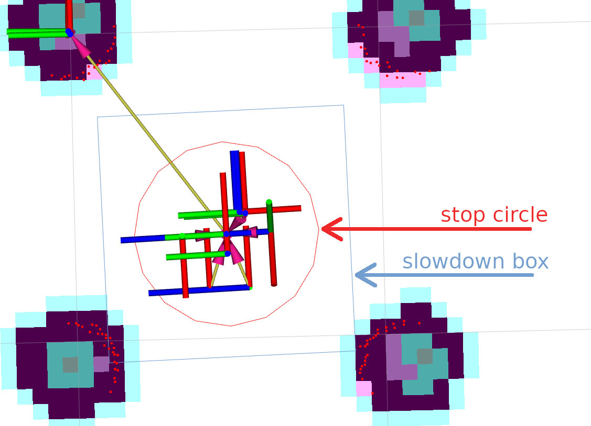
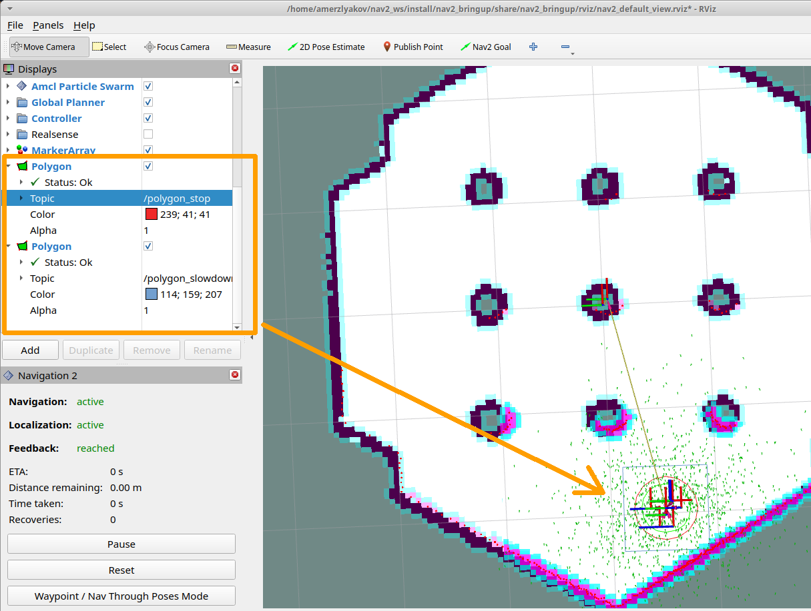
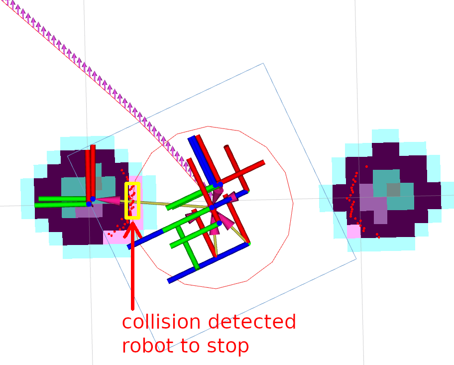

.. _collision_monitor_tutorial:

Using Collision Monitor
***********************

- `Overview`_
- `Requirements`_
- `Preparing Nav2 stack`_
- `Configuring Collision Monitor`_
- `Demo Execution`_

.. image:: images/Collision_Monitor/collision_monitor.gif
  :width: 800px

Overview
========

This tutorial shows how to use a Collision Monitor with Nav2 stack. Based on this tutorial, you can setup it for your environment and needs.

Requirements
============

It is assumed ROS2 and Nav2 dependent packages are installed or built locally.
Please make sure that Nav2 project is also built locally as it was made in :ref:`build-instructions`.

Configuring Collision Monitor
=============================

The Collision Monitor node has its own ``collision_monitor_node.launch.py`` launch-file and preset parameters in the ``collision_monitor_params.yaml`` file for demonstration, though its trivial to add this to Nav2's main launch file if being used in practice.
For the demonstration, two shapes will be created - an inner stop and a larger slowdown bounding boxes placed in the front of the robot:

If more than 3 points will appear inside a slowdown box, the robot will decrease its speed to ``30%`` from its value.
For the cases when obstacles are dangerously close to the robot, inner stop zone will work.
For this setup, the following lines should be added into ``collision_monitor_params.yaml`` parameters file. Stop box is named as ``PolygonStop`` and slowdown bounding box - as ``PolygonSlow``:

.. code-block:: yaml

    polygons: ["PolygonStop", "PolygonSlow"]
    PolygonStop:
      type: "polygon"
      points: [0.4, 0.3, 0.4, -0.3, 0.0, -0.3, 0.0, 0.3]
      action_type: "stop"
      min_points: 4  # max_points: 3 for Humble
      visualize: True
      polygon_pub_topic: "polygon_stop"
    PolygonSlow:
      type: "polygon"
      points: [0.6, 0.4, 0.6, -0.4, 0.0, -0.4, 0.0, 0.4]
      action_type: "slowdown"
      min_points: 4  # max_points: 3 for Humble
      slowdown_ratio: 0.3
      visualize: True
      polygon_pub_topic: "polygon_slowdown"

.. note::
  The circle shape could be used instead of polygon, e.g. for the case of omni-directional robots where the collision can occur from any direction. However, for the tutorial needs, let's focus our view on polygons. For the same reason, we leave out of scope the Approach model. Both of these cases could be easily enabled by referencing to the :ref:`configuring_collision_monitor` configuration guide.

.. note::
  Both polygon shapes in the tutorial were set statically. However, there is an ability to dynamically adjust them over time using topic messages containing vertices points for polygons or footprints. For more information, please refer to the configuration guide.

For the working configuration, at least one data source should be added.
In current demonstration, it is used laser scanner (though ``PointCloud2`` and Range/Sonar/IR sensors are also possible), which is described by the following lines for Collision Monitor node:

.. code-block:: yaml

    observation_sources: ["scan"]
    scan:
      type: "scan"
      topic: "scan"

Set topic names, frame ID-s and timeouts to work correctly with a default Nav2 setup.
The whole ``nav2_collision_monitor/params/collision_monitor_params.yaml`` file in this case will look as follows:

.. code-block:: yaml

    collision_monitor:
      ros__parameters:
        use_sim_time: True
        base_frame_id: "base_footprint"
        odom_frame_id: "odom"
        cmd_vel_in_topic: "cmd_vel_raw"
        cmd_vel_out_topic: "cmd_vel"
        transform_tolerance: 0.5
        source_timeout: 5.0
        stop_pub_timeout: 2.0
        polygons: ["PolygonStop", "PolygonSlow"]
        PolygonStop:
          type: "polygon"
          points: [0.4, 0.3, 0.4, -0.3, 0.0, -0.3, 0.0, 0.3]
          action_type: "stop"
          min_points: 4  # max_points: 3 for Humble
          visualize: True
          polygon_pub_topic: "polygon_stop"
        PolygonSlow:
          type: "polygon"
          points: [0.6, 0.4, 0.6, -0.4, 0.0, -0.4, 0.0, 0.4]
          action_type: "slowdown"
          min_points: 4  # max_points: 3 for Humble
          slowdown_ratio: 0.3
          visualize: True
          polygon_pub_topic: "polygon_slowdown"
        observation_sources: ["scan"]
        scan:
          type: "scan"
          topic: "scan"

Preparing Nav2 stack
====================

The Collision Monitor is designed to operate below Nav2 as an independent safety node.
This acts as a filter on the ``cmd_vel`` topic coming out of the Controller Server.
If no such zone is triggered, then the Controller's ``cmd_vel`` is used.
Else, it is scaled or set to stop as appropriate.
For correct operation of the Collision Monitor with the Controller, it is required to add the ``cmd_vel -> cmd_vel_raw`` remapping to the ``navigation_launch.py`` bringup script as presented below:

.. code-block:: python

    Node(
        package='nav2_controller',
        executable='controller_server',
        output='screen',
        respawn=use_respawn,
        respawn_delay=2.0,
        parameters=[configured_params],
    +   remappings=remappings + [('cmd_vel', 'cmd_vel_raw')]),
    ...
    ComposableNode(
        package='nav2_controller',
        plugin='nav2_controller::ControllerServer',
        name='controller_server',
        parameters=[configured_params],
    +   remappings=remappings + [('cmd_vel', 'cmd_vel_raw')]),

Please note, that the remapped ``cmd_vel_raw`` topic should match to the input velocity ``cmd_vel_in_topic`` parameter value of the Collision Monitor node, and the output velocity ``cmd_vel_out_topic`` parameter value should be actual ``cmd_vel`` to fit the replacement.

Demo Execution
==============

Once Collision Monitor node has been tuned and ``cmd_vel`` topics remapped, Collision Monitor node is ready to run.
For that, run Nav2 stack as written in :ref:`getting_started`:

.. code-block:: bash

  ros2 launch nav2_bringup tb3_simulation_launch.py headless:=False

In parallel console, launch Collision Monitor node by using its launch-file:

.. code-block:: bash

  ros2 launch nav2_collision_monitor collision_monitor_node.launch.py

Since both ``PolygonStop`` and ``PolygonSlow`` polygons will have their own publishers, they could be added to visualization as shown at the picture below:

Set the initial pose and then put Nav2 goal on map.
The robot will start its movement, slowing down while running near the obstacles, and stopping in close proximity to them:

